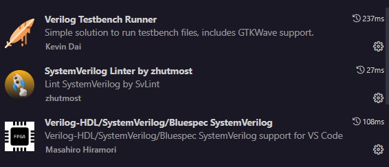

# 💻 Proyecto Arquitectura de Computadores

---

## 🚀 Compilando el Código

Sigue estos sencillos pasos para compilar tu código MUX en Verilog:

 **Super Comando**
```bash
cd .\test\
iverilog -o ../build/{nombre archivo compilado} {archivo testbench}.v ../components/{archivo creador de entidad}
cd ..\view\
vvp ../build/{archivo compilado del testbench}
gtkwave .\{archivo con las señales}
   ```

> *Si no quieres usar el super comando puedes utilizar paso por paso:*

1. **Navega al directorio `testbench`**:
   ```bash
   cd test
   ```

2. **Compila el archivo de testbench**  junto con el módulo:
   ```systemVerilog
   iverilog -g2012 -o pc_testbench .\testPC.sv .\pc.sv
   ```

3. **Ejecuta la simulación**:
   ```bash
      vvp .\pc_testbench
   ```

4. **Ver las señales en WaveTrace**:
   Abres El archivo

La tu simulación se ejecutará, generando un archivo `.vcd` con las señales de entrada y salida.
---

## 📊 Visualiza las Señales en GTKWave

Para hacer tu análisis más visual y entender mejor el comportamiento de tu diseño, sigue estos pasos para ver las señales en **GTKWave**:

1. **Abre GTKWave**:
   ```bash
   gtkwave (*ruta del archivo*)
   ```

2. **Explora las señales**:
   - Selecciona las señales que quieres visualizar.
   - Disfruta viendo cómo cambian las señales de entrada y salida a lo largo del tiempo. ¡Es como darle vida a tu código! 🎉

---

## 🛠️ Recursos Adicionales

Para configurar tu entorno de desarrollo y trabajar con Verilog, te recomiendo los siguientes recursos:

- **Icarus Verilog**: [Guía y descarga](https://bleyer.org/icarus/) 📘
- **MSYS2**: [Instalación y configuración](https://www.msys2.org/) 💻
- **GTKWave**: [Página oficial](https://gtkwave.sourceforge.net/) 🌐
- **Extension Recomendadas:**

---
**JERONIMO RIVEROS PEREA**
